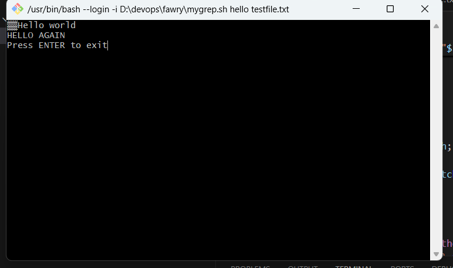

# MyGrep Project

## Screenshots

### Basic search

### With line numbers

### Inverted match with line numbers

### Error handling

Reflective Section
1. How the script handles arguments and options
The script first checks if enough arguments are provided; if not, it prints an error message and exits.
It processes options (-n, -v) by checking the first argument, and sets flags accordingly.
After handling the options, it shifts the parameters to correctly detect the search string and filename.
It uses grep features like -i for case-insensitivity, and constructs the grep command based on the selected options.

2. How would structure change if supporting regex, -i, -c, -l
If I were to add regex support or new options like -i (ignore case, already partially handled), -c (count only), or -l (list filenames with matches),
I would use getopts for better option parsing instead of manual flag handling.
Each option would be processed cleanly and stored in variables, then the final grep command would be built dynamically based on these flags.

3. Hardest part of the script
The hardest part was handling combined options like -vn or -nv correctly.
I needed to make sure that the script could recognize multiple flags at once and apply both invert match and line numbering without breaking the search logic.
Testing for invalid arguments and maintaining clean error messages was also tricky.