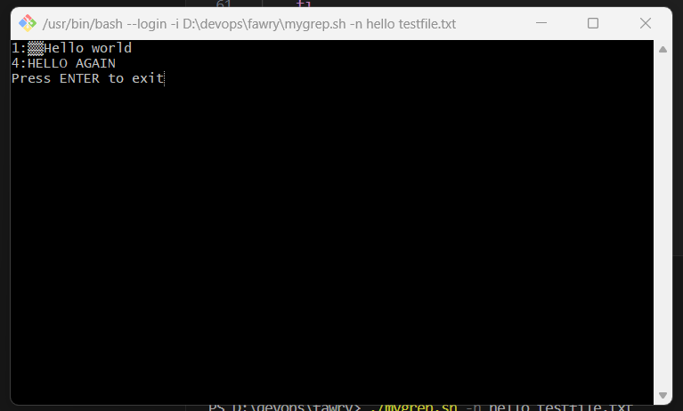
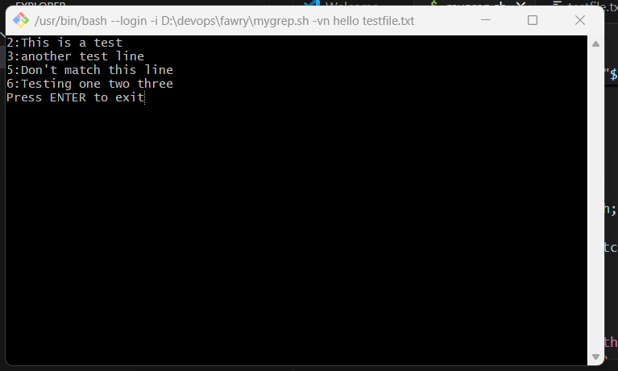
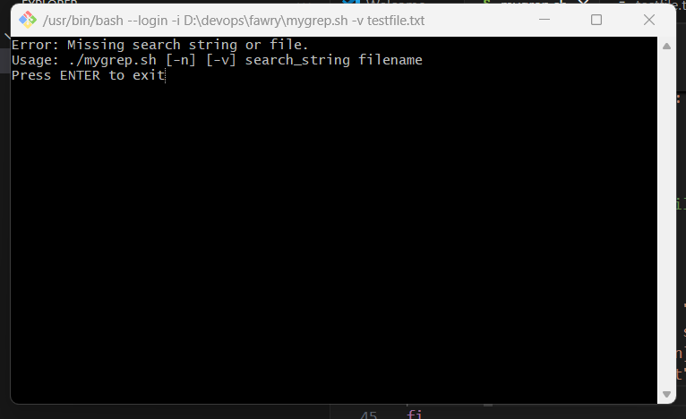
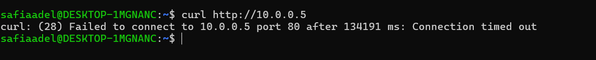

# MyGrep Project & DNS Troubleshooting

---

## Q1: MyGrep Script

### Screenshots

#### Basic Search


#### With Line Numbers


#### Inverted Match with Line Numbers


#### Error Handling


---

### Reflective Section

**1. How the script handles arguments and options**  
- The script first checks if enough arguments are provided. If not, it prints an error message and exits.
- It processes options (-n, -v) by checking the first argument and setting flags accordingly.
- After handling the options, it shifts the parameters to correctly detect the search string and filename.
- It uses grep features like `-i` for case-insensitivity and constructs the grep command based on the selected options.

**2. How would structure change if supporting regex, -i, -c, -l**  
- If I were to add regex support or options like `-i` (ignore case, already partially handled), `-c` (count matches), or `-l` (list filenames with matches), I would use `getopts` for better option parsing instead of manual checks.
- Each option would be stored in a variable, and the final `grep` command would be built dynamically based on the selected options.

**3. Hardest part of the script**  
- Handling combined options like `-vn` or `-nv` correctly was the most challenging.
- Ensuring the script recognized multiple flags and applied both "invert match" and "show line numbers" together without breaking the logic was tricky.
- Also, ensuring clean error handling for invalid arguments required careful checks.

---

## Q2: DNS Troubleshooting Scenario

### Screenshots

#### 1. `/etc/resolv.conf` showing internal DNS


#### 2. Ping internal.example.com (Failing)


#### 3. Curl to internal.example.com (Timeout)


---

### Step-by-Step Troubleshooting

**1. Verify DNS Resolution**
- Checked `/etc/resolv.conf` and confirmed DNS server is set to `10.255.255.254`.
- Tried resolving `internal.example.com`, but it failed.

**2. Diagnose Service Reachability**
- Pinged `internal.example.com`, result: 100% packet loss.
- Tried `curl --max-time 5 http://internal.example.com`, result: connection timeout.

**3. Trace the Issue – List All Possible Causes**

| Potential Cause | Confirmation Step | Command to Diagnose |
|-----------------|--------------------|---------------------|
| DNS server misconfiguration | Check `/etc/resolv.conf` | `cat /etc/resolv.conf` |
| Domain missing in DNS | Manual test with `dig` | `dig internal.example.com @10.255.255.254` |
| Firewall blocking ICMP or HTTP | Test ping and curl | `ping internal.example.com` and `curl` |
| Service down on server | Port scanning | `telnet internal.example.com 80` or `nc -zv internal.example.com 80` |
| Wrong network route | Check routes | `ip route` |
| Internal DNS caching issues | Flush DNS cache | `sudo systemd-resolve --flush-caches` (if available) |

---

### 4. Proposed Fixes

| Issue | How to Confirm | How to Fix |
|------|----------------|------------|
| Bad DNS configuration | `cat /etc/resolv.conf` | Correct DNS settings or manually add `/etc/hosts` entry |
| Firewall issues | No ICMP reply, curl timeout | Adjust firewall rules to allow HTTP (port 80) |
| Service not listening | Telnet or Netcat fails | Restart web server (e.g., `sudo systemctl restart apache2`) |
| Incorrect DNS record | `dig` fails | Update DNS records for `internal.example.com` |

---

### Bonus: Bypass DNS Using `/etc/hosts`

Added an entry to `/etc/hosts`:

```plaintext
10.0.0.5 internal.example.com
